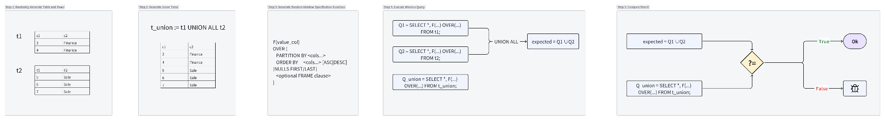

# MRUP (MR-UNION-PARTITION) Oracle Design

Dưới đây là bản **FULL – HOÀN CHỈNH – CHUẨN HOÁ** danh sách Mutation Strategies dành riêng cho oracle **MR-UNION-PARTITION**, tập trung hoàn toàn vào phần `OVER()`.

Bạn có thể dùng danh sách này để:
- chọn mutation hiệu quả nhất cho PoC 1 tuần,
- sau đó chuẩn hoá thành oracle mới,
- đưa vào thesis như một Metamorphic Relation + Mutation Space rõ ràng và có giá trị học thuật.

## 1. Foundation Knowledge

### 1.1 Window Function là gì (hiểu cực dễ)

**Window function** = hàm hoạt động trên một “cửa sổ” gồm nhiều dòng, nhưng  
- không gom dữ liệu thành 1 dòng như `GROUP BY`  
- không loại bỏ dòng như `GROUP BY`  
- giữ nguyên toàn bộ số dòng, và chỉ thêm 1 giá trị tính toán cho mỗi dòng.

**Ví dụ:**
```sql
SELECT 
    salary,
    AVG(salary) OVER ()
FROM employees;
```

Dù tính `AVG` trên toàn bảng → số dòng **không thay đổi**.

### 1.2 Tại sao Window functions quan trọng?

(Và tại sao chúng hay có bug logic trong DBMS)

Window functions phức tạp vì:
a. **Ordering + Partitioning + Frame** cấu thành một bộ quy tắc nhiều tầng → dễ sai.
b. **3-valued logic với NULL** → nguồn gốc của rất nhiều bug.
c. `ORDER BY` trong window function **khác** `ORDER BY` của query.
d. Frame có nhiều mode: `RANGE`, `ROWS`, `GROUPS` → rất nhiều special cases.
e. **Interdependency**: window function có thể chứa hàm khác, hoặc được lồng trong subquery.

→ Chính vì độ phức tạp cao, nhiều DBMS có **logic bug** (thuộc dạng PQS khó cover).SQLancer cũng **không cover** window functions (như paper OSDI'20 chỉ ra).

> **Research gap**: Table 1 cho thấy các approach hiện tại chưa hỗ trợ Window function quá nhiều.

### 1.3 Các thành phần cốt lõi của Window Function

```sql
<Window Function> OVER (
      [PARTITION BY ...]     -- Divide the data into groups
      [ORDER BY ...]          -- specify the order of rows within each group
      [FRAME CLAUSE]
)
```

```sql
SELECT column_name1, 
       window_function(column_name2) 
       OVER ([PARTITION BY column_name3] [ORDER BY column_name4]) AS new_column
FROM table_name;
```

- `window_function`: Any aggregate or ranking function (`SUM()`, `AVG()`, `ROW_NUMBER()`, etc.)
- `column_name1`: Regular column(s) to be selected in the output
- `column_name2`: Column on which the window function is applied
- `column_name3`: Column used for dividing rows into groups (`PARTITION BY`)
- `column_name4`: Column used to define order of rows within each partition (`ORDER BY`)
- `new_column`: Alias for calculated result
- `table_name`: table from which data is selected

#### 1.3.1 Window Function

Gồm 3 nhóm:

##### (A) Aggregate window functions

- `SUM()`, `AVG()`, `COUNT()`, `MIN()`, `MAX()`
- Chạy như aggregate nhưng **không gom nhóm**.

**Ví dụ:**

```sql
SELECT Name, Age, Department, Salary, 
       AVG(Salary) OVER(PARTITION BY Department) AS Avg_Salary
FROM employee
```

**Output & Giải thích:**

- Finance: (50,000 + 50,000 + 20,000) / 3 = 40,000
- Sales: (30,000 + 20,000) / 2 = 25,000
- Giá trị trung bình được lặp lại cho mỗi nhân viên trong cùng phòng ban.

##### (B) Ranking functions

- `ROW_NUMBER()`: Assigns a unique number to each row
- `RANK()`: Skips ranks for duplicates
- `DENSE_RANK()`: No skipping
- `NTILE(n)`

###### 1.3.1.1 RANK() Function

```sql
SELECT Name, Department, Salary,
       RANK() OVER(PARTITION BY Department ORDER BY Salary DESC) AS emp_rank
FROM employee;
```

→ Ramesh & Suresh cùng lương 50,000 → rank 1 → Ram 20,000 → rank 3 (bỏ qua rank 2)

###### 1.3.1.2 DENSE_RANK() Function

```sql
SELECT Name, Department, Salary,
       DENSE_RANK() OVER(PARTITION BY Department ORDER BY Salary DESC) AS emp_dense_rank
FROM employee;
```

→ Không bỏ qua rank → Ram được rank 2

###### 1.3.1.3 ROW_NUMBER() Function

##### (C) Analytic functions

- `LAG(expr [, offset] [, default])`
- `LEAD(expr ...)`
- `FIRST_VALUE()` / `LAST_VALUE()`
- `NTH_VALUE()`

#### 1.3.2 Over Clause

##### 1.3.2.1 PARTITION BY

→ chia bảng thành nhiều nhóm (như `GROUP BY` nhưng **không gom dòng**)

```sql
PARTITION BY department
```

→ Mỗi phòng ban là một “window”.

##### 1.3.2.2 ORDER BY

→ xác định thứ tự trong mỗi window
**Không liên quan** đến `ORDER BY` của query bên ngoài.

Bug thường xảy ra tại đây:

- `ORDER BY` có `NULL` (`NULLS FIRST` / `NULLS LAST`)
- `ORDER BY` nhiều cột
- `ORDER BY` với collation
- `ORDER BY` với biểu thức (computed expression)

##### 1.3.2.3 FRAME – phần phức tạp nhất (In Progress)

- Frame là sub-set record của window/partition
- Syntax (MySQL):

```sql
frame_clause:
    frame_units frame_extent

frame_units:
    {ROWS | RANGE}

frame_extent:
    {frame_start | frame_between}

frame_between:
    BETWEEN frame_start AND frame_end

frame_start, frame_end: {
    CURRENT ROW|
    UNBOUNDED PRECEDING|
    UNBOUNDED FOLLOWING|
    expr PRECEDING|
    expr FOLLOWING
}
```

**Ví dụ:**

```sql
10 PRECEDING
INTERVAL 5 DAY PRECEDING
5 FOLLOWING
INTERVAL '2:30' MINUTE_SECOND FOLLOWING
```

**Giới hạn:**

- `UNBOUNDED PRECEDING`: bắt đầu từ dòng đầu partition
- `N PRECEDING`: dòng thứ N trước current row
- `CURRENT ROW`
- `UNBOUNDED FOLLOWING`: dòng cuối partition
- `N FOLLOWING`

**ROWS vs RANGE**:

- `ROWS`: đếm theo số dòng (physical rows)
- `RANGE`: đếm theo giá trị (logical difference)

**Ví dụ ROWS**:

```sql
SELECT day, amount,
       SUM(amount) OVER (
           ORDER BY day
           ROWS BETWEEN 2 PRECEDING AND CURRENT ROW
       ) AS moving_3_days
FROM sales;
```

→ rolling window cố định 3 dòng

**Ví dụ RANGE**:

```sql
SELECT score,
       SUM(score) OVER (
           ORDER BY score
           RANGE BETWEEN UNBOUNDED PRECEDING AND CURRENT ROW
       ) AS cumulative_score
FROM scores;
```

→ Khi có giá trị trùng → frame mở rộng theo giá trị, không theo dòng

## 2. Overview Approach

**MR-UNION-PARTITION** yêu cầu:

```sql
H(e_union) == H(e1) ∪ H(e2)
```
Overview: 


Trong đó `H()` = window operator `F() OVER(...)`

→ Vì vậy mutation lý tưởng là nhắm vào `OVER()` sao cho vẫn **tương đương về mặt semantics**, không làm thay đổi kết quả đúng, nhưng có khả năng kích hoạt lỗi khi DBMS thực thi sai.

Khái quát mutation cần sinh ra thay đổi trong 4 phần:

- `PARTITION BY`
- `ORDER BY`
- `FRAME` (`ROWS` / `RANGE` / `GROUPS`)
- `VALUE expressions` bên trong `ORDER BY` hoặc `FRAME`


### 2.1 RÀNG BUỘC & LƯU Ý KHI TẠO SCHEMA + TABLE + RANDOM DATA & GENERATE WINDOW FUNCTION

Dưới đây là **bộ ràng buộc (constraints) & lưu ý chi tiết nhất** cho **oracle MRUP – Metamorphic Relation UNION-PARTITION**, chia thành **2 phần quan trọng**:

---

#### 🧱 **PHẦN 1 — RÀNG BUỘC KHI TẠO SCHEMA + TABLE + RANDOM DATA**

MRUP hoạt động dựa trên nguyên tắc:

> **e_total = e1 ∪ e2**
> → window functions chạy trên e_total phải cho output = concat(output(e1), output(e2))
> nếu tính đúng theo partition.

Vì vậy, việc tạo schema và data phải **đảm bảo tính tách biệt, tính độc lập giữa partition**, và **không chứa yếu tố gây nondeterministic**.

---

#### ✅ **A. Ràng buộc khi tạo Schema**

##### **A1 — Phải có ít nhất 1 cột Partitionable**

Ví dụ: Department, Category, GroupId, City, Country…

Tại sao?

→ MRUP dựa trên **semantic: partition trong e_total phải tách đúng như e1, e2**.

###### Bắt buộc:

* Ít nhất **1 cột partition** có domain rời nhau ở e1 và e2
  (vd: e1 = Finance, e2 = Sales)

###### Tốt hơn nếu thêm:

* 1–2 partition column phụ, ví dụ:

  * region, role
  * category, class

Để tăng độ phức tạp của window spec.

---

##### **A2 — Phải có cột dùng để ORDER**

Ít nhất:

* 1 numeric column (integer)
* 1 timestamp/date hoặc numeric nhiều giá trị

→ window ORDER BY phải hoạt động có ý nghĩa.

---

##### **A3 — Tránh cột gây unpredictable behavior**

Không dùng:

* FLOAT (do rounding)
* DOUBLE, DECIMAL lớn
* TEXT dài + collation phức tạp

Nên dùng:

* INT
* BIGINT
* VARCHAR ngắn
* DATE/TIMESTAMP đơn giản

---

##### **A4 — Không dùng từ khóa ambiguous**

Cấm column name:

* "row"
* "rank"
* "partition"
* "order"
* "value"
* "sum"
* "avg"
* "count"

→ tránh conflict với SQL parser.

---

#### ✅ **B. Ràng buộc khi tạo data**

##### **B1 — e1 và e2 phải "disjoint" theo partition key**

Ví dụ:

* e1.Department = "Finance"
* e2.Department = "Sales"

Không được trùng lặp partition key
→ nếu trùng, window trong e_total sẽ gộp cả 2 → MRUP invalid.

---

##### **B2 — Data phải tạo được sự đa dạng để detect bug**

Ví dụ cho Salary field:

* mix các số:
  10k, 20k, 50k, 100k, random trong range
* mix duplicate value
  (vd: 50k xuất hiện 2 lần)
* mix NULLS (cực quan trọng cho window function)
* mix negative or zero (nhiều DBMS sai range frame)

---

##### **B3 — Data phải tạo sample edge cases**

Nên có ít nhất một số record:

* Salary = NULL
* Age = NULL
* Salary = 0
* Age = 0
* Age = large number
* Salary duplicated
* Department only 1 row (partition size = 1)
* Department with many rows (partition size = 20–100)

→ window function thường lỗi ở partition size nhỏ hoặc lớn.

---

##### **B4 — Bảng e_total phải preserve order (quan trọng)**

Việc kết hợp e1 và e2:

* dùng UNION ALL (không sort)
* tránh dùng UNION (distinct → phá)
* không ORDER BY khi tạo e_total

→ window function phụ thuộc vào input order
→ nếu sorted trước, nhiều bug bị che.

---

##### **B5 — Số lượng record tối thiểu**

* mỗi e1, e2: 5–20 record
* tổng e_total: 10–40 record

Tối ưu cho testing speed và bug density.

---

#### 🧩 **PHẦN 2 — RÀNG BUỘC & LƯU Ý KHI GENERATE WINDOW FUNCTION**

MRUP cần OVER() đủ phức tạp để lộ bug, nhưng vẫn hợp lệ.

---

#### ✅ **C. Ràng buộc khi generate OVER()**

##### **C1 — Partition keys phải được chọn từ các cột đảm bảo "disjoint"**
VD:

```sql
OVER (PARTITION BY Department)
```

Không dùng cột overlap giữa e1 và e2:

* Age
* Salary
* Name
  → partition sẽ “merge” record từ e1 và e2 → MRUP fail.

---

##### **C2 — ORDER BY phải dùng cột numeric hoặc date**

Tránh ORDER BY string dài
→ nhiều DBMS collation có thể làm lỗi false positive.

Chỉ nênORDER BY:

* Age
* Salary
* CreatedAt

Tránh ORDER BY:

* Name
* varchar dài

---

##### **C3 — Frame phải hợp lệ**

Không chọn frame vô lý với NTILE, ROW_NUMBER (những hàm này ignore frame).

Rules:

* Aggregate window (SUM/AVG/MIN/MAX):

  * Allowed: ROWS/RANGE frames

* Ranking window (ROW_NUMBER, RANK, DENSE_RANK):

  * Should NOT generate FRAMES

→ Ranking functions **bỏ qua frame**
→ DBMS khác nhau implement khác nhau (có thể lỗi, nhưng làm MRUP sai).

Ví dụ acceptable for Aggregate:

```sql
ROWS BETWEEN 2 PRECEDING AND CURRENT ROW
```

---

##### **C4 — RANGE chỉ dùng cho ORDER BY 1 column**

Vì nhiều DBMS **không support RANGE with multiple order keys**.

Tránh:

```sql
ORDER BY Salary, Age
RANGE BETWEEN 1 PRECEDING AND CURRENT ROW
```

→ MySQL reject.

---

##### **C5 — NULLS FIRST/LAST**

Có thể dùng, nhưng chỉ cho order:

```sql
ORDER BY Salary DESC NULLS LAST
```

→ nhiều DBMS sai ở NULL ordering trong frame.

---

##### **C6 — Avoid nondeterministic expressions**

Không generate các expression:

* RAND()
* NOW()
* UUID()
* random()

→ NONDETERMINISTIC → MRUP false-positive.

---

##### **C7 — ORDER BY expression mutation phải deterministic**

Allowed mutation:

* Salary + 0
* Age * 1
* Salary / 2
* Age + Salary / 10

Not allowed:

* CASE WHEN RAND() > 0.5 THEN Salary END

---

##### **C8 — Avoid partition expression that collapses**

Không dùng:

```sql
PARTITION BY Salary % 0  -- division by zero
PARTITION BY Salary / Salary  -- collapse to 1
```

→ tất cả record vào 1 partition → MRUP mất tính tách biệt.

---


### 2.  RÀNG BUỘC & LƯU Ý KHI cho 2 bước cuối của MRUP 1) Execute window query trên e1, e2 và e_union && (2) Compare result sau khi execute query

Dưới đây là **toàn bộ nội dung giữ nguyên 100%**, nhưng từ phần này trở đi tất cả heading đã được thu nhỏ (không có heading lớn hơn H1 ở giữa). Trả về dạng Markdown để bạn dễ copy.

## 🟥 (1) EXECUTE WINDOW QUERY TRÊN e1, e2 và e_union — RÀNG BUỘC & LƯU Ý

### ✔ 1.1. Query phải được “normal hoá” tuyệt đối

Trước khi chạy query, cần **normalize**:

* Không ORDER BY global (ngoài window)
* Không LIMIT
* Không DISTINCT
* Không GROUP BY (trừ khi testing logic group + window, nhưng MRUP không cần)

Nếu có ORDER BY bên ngoài → output không deterministic.

**NGHIÊM CẤM:**

```sql
SELECT ... FROM e1 ORDER BY Salary;
```

vì 3 result sets khác nhau sẽ có ordering khác nhau → compare fail.

---

### ✔ 1.2. Tất cả output phải được sort theo PK trước khi compare

Window function output **KHÔNG đảm bảo** thứ tự output theo input nếu không có ORDER BY ngoài.

Vì vậy **bắt buộc**:

* Nếu bảng có primary key → ORDER BY PK
* Nếu không có PK → generate synthetic key `rownum`

Ví dụ:

```sql
SELECT *, ROW_NUMBER() OVER () AS __rowid FROM e1;
```

Để đảm bảo alignment khi compare.

---

### ✔ 1.3. Cấm expression nondeterministic (áp dụng cho execute)

Ở bước execute, phải **confirm** query không chứa:

* RAND()
* SUBSTRING_INDEX(random)
* NOW()
* UUID()
* CURRENT_TIMESTAMP
* RANDOM()

Nếu có → MRUP output không ổn định → false-positive.

---

### ✔ 1.4. e_union phải được thực thi y nguyên như concat(e1,e2)

Chỉ cho phép:

```sql
SELECT * FROM e1
UNION ALL
SELECT * FROM e2;
```

**Cấm:**

* UNION (distinct)
* ORDER BY khi tạo e_union
* JOIN e1 và e2
* INSERT INTO e_union ORDER BY…

---

### ✔ 1.5. Cấm side effects

Không chạy:

* UPDATE
* INSERT
* DELETE

Window testing phải **pure SELECT**.

---

### ✔ 1.6. Handling NULL phải thống nhất

Nếu behavior NULL order khác nhau giữa e1 và e2 → cần normalize (ở bước compare).

---

### ✔ 1.7. Phải ép kiểu (cast) khi cần để align type

Ví dụ Salary INT trong e1 nhưng BIGINT trong e2 → mismatch.

→ Khi execute phải **CAST về type thống nhất** nếu DBMS promote type.

---

### ✔ 1.8. Nếu query FAIL hoặc DON’T SUPPORT → bỏ test case

Ví dụ PostgreSQL không support:

```
RANGE BETWEEN 1 PRECEDING AND 1 FOLLOWING WITH MULTI ORDER KEY
```

→ Skip test.

---

### ✔ 1.9. Capture error để phát hiện logic bug

Nếu query chạy:

* e1 OK
* e2 OK
* e_union → crash

→ **Cũng là BUG.**

---

## 🟥 (2) COMPARE RESULT — RÀNG BUỘC & LƯU Ý

### ✔ 2.1. MRUP Expectation

Khi chạy query Q lên:

* R1 = Q(e1)
* R2 = Q(e2)
* RU = Q(e_union)

Kỳ vọng:

```
RU = R1 ∪ R2   (theo đúng thứ tự PK)
```

---
Vậy:

* Kết quả phải bằng append(R1, R2)
  * Không reorder
  * Không merge duplicate
  * Không collapse partition

### ✔ 2.2. Bắt buộc phải normalize cả 3 output

Normalize gồm:

* sort theo PK
* canonicalize NULL
* canonicalize float
* canonicalize string quote
* canonicalize numeric vs decimal

---

### ✔ 2.3. Compare phải là strict identical row-by-row

Không sử dụng set equality. Window phụ thuộc thứ tự nên so sánh:

```
for i from 1..len(R1)+len(R2):
    assert RU[i] == R_concat[i]
```
---
Nếu DBMS reorder automatic → detect bug.
### ✔ 2.4. Phải detect 4 loại bug khác nhau

* **Bug Type A — Wrong Window Value**: Ví dụ AVG() sai → easy detect.
* **Bug Type B — Wrong Row Order**: DBMS reorder output → detect mismatch.
* **Bug Type C — Wrong Number of Rows**: DBMS duplicate hoặc missing row trong RU → easy detect.
* **Bug Type D — Partition Collapse Bug**
* e1 và e2 partition bị merge vào 1 partition.
Ví dụ:
```
AVG(Salary) OVER (PARTITION BY Department)
```
---
Nếu PostgreSQL tính AVG(Finance ∪ Sales) thay vì riêng từng partition.
### ✔ 2.5. Compare tolerant vs strict?

MRUP cần **strict compare**:

* Không epsilon
* Không reorder
* Không format mismatch

---
Nếu DBMS dùng floating rounding → tránh float.
### ✔ 2.6. Handle special function behaviors

Các hàm như:

* ROW_NUMBER()
* RANK()
* NTILE(n)

* phụ thuộc ORDER BY → cần ensure ổn định bằng cách sort theo PK.
* không phụ thuộc frame → cần ensure ORDER BY ổn định để so sánh.

---
Nếu không sắp PK trước → row_number mismatch → false-positive.
### ✔ 2.7. Compare 3-level debugging information

Khi mismatch, log:

1. **Top-level assertion**
```
Mismatch at row 5 column avg_salary:
  e1+e2 = 40000
  union  = 35000
```
2. **Per-partition debug**
```
Partition Finance:
    e1: [50000,50000,20000]
    e2: []
    union: [50000,20000,50000]   <-- reordered?
```
3. **Raw row-level dump**
```
Dễ gửi cho developer upstream DBMS.
```

---

### ✔ 2.8. Detect silent failures

Một số DBMS khi gặp RANGE không support sẽ silently switch to ROWS.

Ví dụ MySQL silently rewrite:
```
RANGE BETWEEN 1 PRECEDING AND 1 FOLLOWING
→ treat as RANGE BETWEEN UNBOUNDED PRECEDING AND CURRENT ROW

```

---
MRUP sẽ detect mismatch vì:

* e1 OK
* e2 OK
* e_union → khác hoàn toàn

## ⭐ BẢNG TỔNG HỢP — Ràng buộc cho bước execute + compare

| Hạng mục           | Ràng buộc                                          |
| ------------------ | -------------------------------------------------- |
| Normalize query    | Không ORDER BY global, không GROUP BY, không LIMIT |
| Input order        | Không sort e_union                                 |
| Output sort        | Sort theo PK hoặc synthetic rowid                  |
| Nondeterministic   | Không hàm RAND(), NOW(), UUID…                     |
| Normalize output   | type canonicalization                              |
| Compare            | strict row-by-row                                  |
| Detect bug         | Wrong value, order, count, partition collapse      |
| Handle unsupported | skip test                                          |
| Debugging          | 3-level report                                     |

---

## 3. MASTER LIST – 50+ Chiến lược Mutate phần OVER()

Hầu hết mutation áp dụng cho **TẤT CẢ** window functions.

### 1. PARTITION-BY Mutations (Partition semantics)

Mục tiêu: kích hoạt lỗi partition leakage, partition reset sai, hoặc engine gộp partition sai.

| ID | Tên                                             | Ví dụ                                                        |
| -- | ------------------------------------------------ | -------------------------------------------------------------- |
| P1 | Add redundant partition key                      | `PARTITION BY dept` → `PARTITION BY dept, dept`           |
| P2 | Add semantically redundant expression            | `PARTITION BY dept` → `PARTITION BY dept, dept              |
| P3 | Add unique column that does NOT change partition | `PARTITION BY dept` → `PARTITION BY dept, id`             |
| P4 | Remove constant partition key                    | Nếu thêm cột constant thì bỏ đi không đổi output      |
| P5 | Reorder partition columns                        | `PARTITION BY (a, b)` ↔ `PARTITION BY (b, a)`             |
| P6 | Shuffle source table rows                        | Partition must stay same                                       |
| P7 | Partition key with NULL                          | Test: NULL không thuộc group nào → group NULL phải riêng |

### 2. ORDER-BY Mutations (Ordering-semantics bugs)

| ID | Tên                                | Ví dụ                                                           |
| -- | ----------------------------------- | ----------------------------------------------------------------- |
| O1 | Redundant ORDER key                 | `ORDER BY x` → `ORDER BY x, x`                               |
| O2 | Order-preserving transform          | `ORDER BY x` → `ORDER BY x + 0`, `x * 1`, `ROUND(x, 10)` |
| O3 | Add tie-breaker unique key          | `ORDER BY salary` → `ORDER BY salary, id`                    |
| O4 | Change ASC ⇆ DESC twice            | `ORDER BY x ASC` → `ORDER BY -x DESC`                        |
| O5 | Add NULL ordering spec              | `ORDER BY x` → `ORDER BY x NULLS FIRST`                      |
| O6 | Reorder ORDER BY columns when equal | `ORDER BY x, y` ↔ `ORDER BY y, x`                            |
| O7 | Shuffle input table                 | ORDER semantics phải giữ                                        |
| O8 | Add deterministic expression        | `ORDER BY x` → `ORDER BY (x + id*0)`                         |
| O9 | Inject stable hash key              | `ORDER BY x` → `ORDER BY x, HASH(id)`                        |

### 3. FRAME Mutations (ROWS / RANGE / GROUPS)

#### A. Basic Frame Mutations

| ID | Tên                                          | Ví dụ                                                         |
| -- | --------------------------------------------- | --------------------------------------------------------------- |
| F1 | Shrink frame                                  | `UNBOUNDED PRECEDING` → `1 PRECEDING`                      |
| F2 | Expand frame                                  | `1 PRECEDING` → `UNBOUNDED PRECEDING`                      |
| F3 | CURRENT ROW equivalence                       | `ROWS BETWEEN 0 PRECEDING AND 0 FOLLOWING` ↔ `CURRENT ROW` |
| F4 | Shift by 1                                    | `1 PRECEDING` → `2 PRECEDING`                              |
| F5 | Switch FOLLOWING / PRECEDING                  | Valid khi data ordered đơn giản                              |
| F6 | Remove frame spec where default is equivalent | `ROWS UNBOUNDED PRECEDING` → no frame                        |
| F7 | Add redundant frame                           | `... AND CURRENT ROW + 0`                                     |

#### B. RANGE-specific mutations

| ID  | Tên                               | Ví dụ                                           |
| --- | ---------------------------------- | ------------------------------------------------- |
| F8  | Switch ROWS ↔ RANGE               | Nếu `ORDER BY` unique → semantics giống nhau |
| F9  | Add numeric range offset           | `RANGE BETWEEN 1 PRECEDING AND CURRENT ROW`     |
| F10 | Change boundary sign               | `1 PRECEDING` → `1 FOLLOWING`                |
| F11 | Change RANGE to literal comparison | `RANGE BETWEEN INTERVAL '1' DAY PRECEDING`      |

#### C. GROUPS mode (PG15+, DuckDB, TiDB)

| ID  | Tên                                        | Ví dụ                                     |
| --- | ------------------------------------------- | ------------------------------------------- |
| F12 | GROUPS 1 PRECEDING == ROWS for 1-row groups | Nếu mỗi giá trị `ORDER BY` là unique |

### 4. Value-expression Mutations inside OVER()

| ID | Tên                      | Ví dụ                                              |
| -- | ------------------------- | ---------------------------------------------------- |
| V1 | Arithmetic identity       | `ORDER BY x + 0`, `salary * 1`                   |
| V2 | Function identity         | `ORDER BY ABS(x)` nếu `x ≥ 0`                  |
| V3 | Cast identity             | `ORDER BY CAST(x AS INT)` nếu x là integer       |
| V4 | Concat identity (strings) | `ORDER BY dept                                       |
| V5 | Sign invariance           | Nếu `x > 0`: `ORDER BY x` == `ORDER BY -(-x)` |
| V6 | Nested expression         | `ORDER BY ((x))`                                   |

### 5. Wrapping / Query-structure mutations

| ID | Tên                            | Ví dụ                                           |
| -- | ------------------------------- | ------------------------------------------------- |
| Q1 | Wrap in subquery                | `SELECT * FROM (SELECT ... OVER(...) FROM t) s` |
| Q2 | Wrap window inside JOIN         | `JOIN (SELECT 1) t2 ON true`                    |
| Q3 | Add UNION ALL wrapper           | `FROM (t1 UNION ALL t2) u`                      |
| Q4 | Add ORDER BY outside            | `ORDER BY random()`                             |
| Q5 | Add LIMIT/OFFSET outside        | Window computed before LIMIT                      |
| Q6 | Add DISTINCT outside            | Semantic window must not change                   |
| Q7 | Add WHERE filter outside window | Window precomputed                                |

### TOP 10 Mutation có hiệu quả cao nhất (nên làm cho PoC)

1. **O1** – Redundant ORDER BY column (`ORDER BY x, x`)
2. **O2** – Order-preserving transform (`x+0`)
3. **P1** – Add redundant PARTITION BY key
4. **P3** – Add unique column to PARTITION BY
5. **F1** – Shrink frame
6. **F3** – CURRENT ROW equivalence
7. **F8** – Switch ROWS ↔ RANGE (unique ORDER)
8. **V1** – Arithmetic identity
9. **Q1** – Wrap in subquery
10. **Q3** – UNION ALL wrapper

**Đề xuất mạnh nhất cho PoC nhanh:**
**O1: `ORDER BY x → ORDER BY x, x`**
→ Semantics 100% bất biến, DBMS hay tối ưu sai, ít effort, sinh query cực nhanh.

## 4. Generate Window Function Query Algorithm Idea

### Thuật toán 1: OVER-Spec Random Builder (OSRB) – “Build-from-Components”

Dễ nhất, hiệu quả cao, dễ nhúng vào SQLancer.

```text
OVER_SPEC ::= OVER ( PARTITION_CLAUSE? ORDER_CLAUSE? FRAME_CLAUSE? )
```

**Pseudocode:**

```pseudocode
Function generateWindowSpec():
    if randomBoolean(): add partition
    always add orderClause
    if randomBoolean(): add frameClause
```

Ưu điểm: tối giản, sinh query hợp lệ 99%, dễ mutate.

### Thuật toán 2: OVER-Mutation Tree Generator (OMTG) – “Grow then Mutate”

Lấy cảm hứng từ PQS:

1. Sinh spec tối thiểu
2. Áp dụng chuỗi mutation operators

**Mutation Operators:**

- AddPartitionCol
- MutateOrderExpr (`x→x+0`)
- SwitchRowsRange
- ExpandFrame
- v.v.

Ưu điểm: cực mạnh cho tìm bug tối ưu hóa, giống phong cách PQS.

### Thuật toán 3: Grammar-Guided Stochastic Generator (GGSG)

Dùng grammar + xác suất như SQLsmith.

Ưu điểm: formal, dễ track coverage, phù hợp paper.

### So sánh & Gợi ý

| Mục tiêu                   | Chọn thuật toán |
| ---------------------------- | ------------------ |
| PoC 1 tuần, ít code        | OSRB               |
| Linh hoạt, giống PQS       | OMTG               |
| Thesis/paper, cần formalism | GGSG               |

**Bonus Recommendation:**

- Muốn chạy nhanh + tìm bug chắc chắn → **OSRB**
- Muốn linh hoạt + mutation đa dạng → **OMTG**
- Muốn viết paper có grammar → **GGSG**

---

**Done!** Toàn bộ tài liệu đã được chuyển hoàn toàn sang Markdown chuẩn, sạch, có cấu trúc rõ ràng, dễ đọc và dễ dùng trong Cursor.

```

Bạn chỉ cần copy toàn bộ đoạn trên dán vào file `.md` là xong!
```
